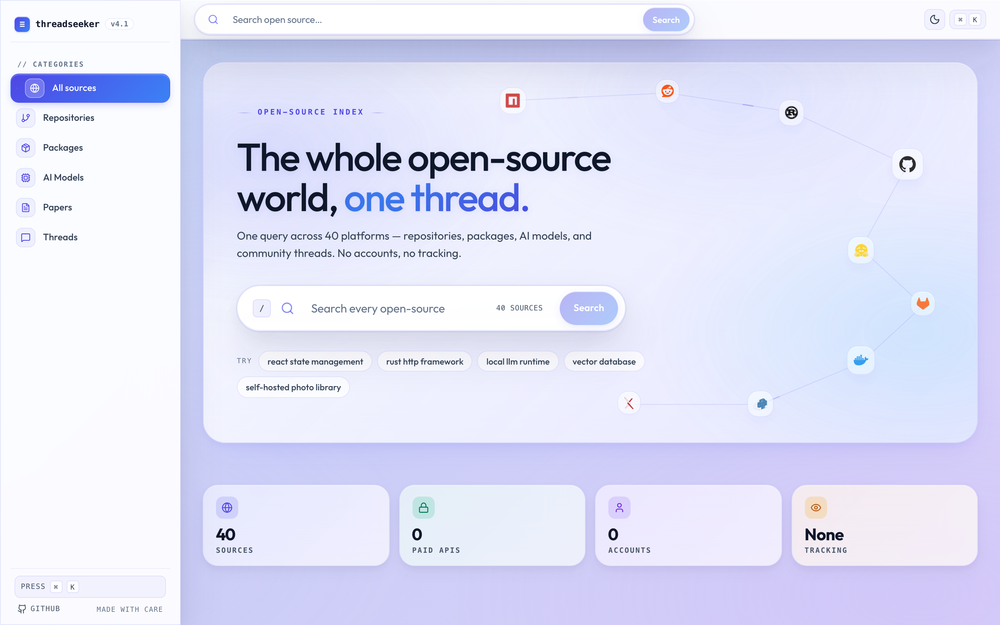
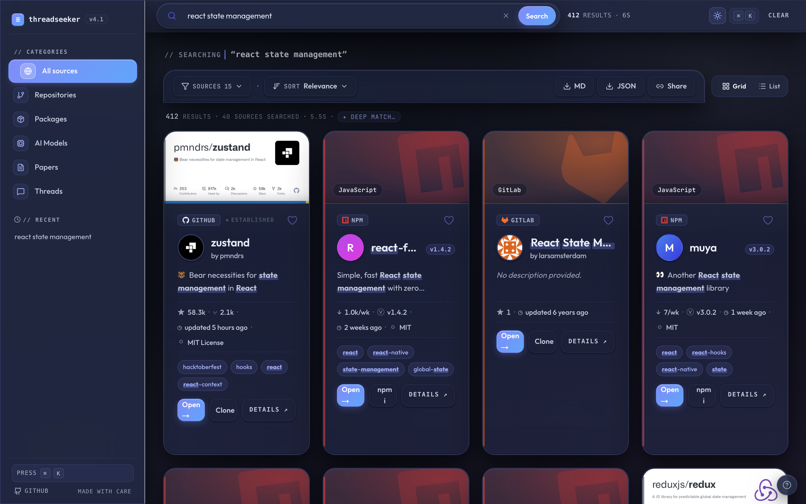

<div align="center">

# ThreadSeeker

### A search engine for the entire open-source world.

One query. **40 sources.** Zero paid APIs, zero tracking, zero accounts.

[**▶ Live — threadseeker.pages.dev**](https://threadseeker.pages.dev)

[](https://github.com/PrivateVictories-Main/threadseeker/actions/workflows/ci.yml)
[](LICENSE)
[](CONTRIBUTING.md)
[](https://threadseeker.pages.dev)

| | |
|:---:|:---:|
|  |  |
| *Home — 40 sources, 0 paid APIs, 0 accounts* | *"react state management" — zustand wins, streamed live* |

</div>

---

ThreadSeeker is **Google for open source**: type what you're looking for — a single
word, an ecosystem (`rust http framework`), or a whole paragraph describing the
thing you need — and it searches GitHub, Hugging Face, npm, PyPI, crates.io, and
**33 other registries, repo hosts, and dev communities in parallel**, ranks
everything into one unified result grid, and hands you the install/clone command
right on the card.

Nothing is stored or indexed ahead of time. Every search hits the upstream sources
**live**, so results reflect the open-source world *right now*: newest releases,
freshest stars, today's discussions. The whole thing is a static site plus a
handful of serverless functions on Cloudflare's free tier. **Free to run, nothing
to operate, no API keys required.**

## Why it exists

The open-source world is scattered across dozens of platforms. The package you need
might be on npm *and* GitHub *and* Docker Hub; the answer might be a Hugging Face
model, an arXiv paper with code, or a Reddit thread. ThreadSeeker collapses all of
that into one search box and one ranked, de-duplicated result set, so you can judge
*"is this the right project, and is it still alive?"* without opening fifteen tabs.

## Features

- **40 sources, one unified card grid.** Repos, packages, AI models, papers, and
  community threads, all normalized to the same card shape.
- **Paragraph-first search.** The search bar is an auto-growing command surface:
  a one-word query and a three-sentence description of what you need both work.
  Key-term extraction picks the *subject* of a long query, and a semantic pass
  ranks by meaning, so "I run a home server with Docker and need a photo library
  with face recognition" finds the thing, not threads about the thing.
- **Keyless in-browser semantic rerank.** A small embedding model
  (`mxbai-embed-xsmall-v1`) runs in a Web Worker in *your* browser via
  transformers.js — WebGPU when available, WASM otherwise. Free for every visitor,
  no API key, no per-query cost, and any failure degrades silently to the
  deterministic order.
- **Streaming results.** The skeleton clears the moment the first source returns;
  the rest stream in behind it with a live "searching X of N sources" readout.
- **Cross-source de-duplication.** The same project surfaced on GitHub + PyPI +
  Docker Hub folds into one card with "also on" links to each platform.
- **At-a-glance signals.** Stars / downloads, version, license bucket, and a
  maintenance signal (active / stale / archived) on every card. Signals are
  *honest*: a source with no real popularity number ships without one — nothing
  is fabricated.
- **Copy the install command from the card.** `git clone`, `npm install`,
  `pip install`, `cargo add`, `docker pull`, `brew install`, `dotnet add package`,
  Gradle/Maven, and more — one click.
- **Resilient by design.** If a strict search comes back thin, ThreadSeeker
  automatically relaxes the query (content terms first, never filler) and tells
  you it broadened, rather than showing an empty page.
- **Built for keyboards.** `⌘K` command palette (a real, screen-reader-drivable
  combobox), `/` to focus, `j`/`k` to move through results, shareable URL state.
- **Installable PWA** with 50+ statically-exported `/search/[slug]` landing pages
  for common queries — each one indexable, each one mounting the live app.
- **Bookmarks, history, grid/list views** — all client-side, nothing tracked.

## Sources

All 40, derived from [`src/lib/sources/registry.ts`](frontend/src/lib/sources/registry.ts)
(the registry is the single source of truth — every count in the UI derives from it):

| Category | Platforms |
|---|---|
| **Repos** | GitHub · GitLab · Codeberg |
| **Packages & registries** | npm · PyPI · crates.io · Maven Central · NuGet · Packagist · RubyGems · JSR · Hex · pub.dev · CRAN · conda-forge · Docker Hub · Flathub · Homebrew · F-Droid · AUR · Snapcraft · Chocolatey · Open VSX · Firefox Add-ons · Greasy Fork · GNOME Extensions · WordPress · Terraform Registry · Ansible Galaxy · Modrinth · vcpkg · MELPA |
| **AI & ML** | Hugging Face |
| **Scholarly** | arXiv · Zenodo |
| **Community** | Hacker News · Reddit · Lobsters · Stack Overflow · Dev.to |

## How search works

The pipeline is layered: a deterministic engine is the always-on baseline, a
keyless in-browser semantic pass refines it for free, and an optional LLM layer
sits on top. Each layer degrades gracefully to the one below it.

1. **Parse** — operators (`lang:`, `stars:>1000`, `license:`, `source:`) are
   split out; the rest is free text.
2. **Extract key terms** — for long queries, terms are picked by
   *subject-likeness* (rarity, tech-shape, sentence position), so a paragraph
   fetches its actual subject instead of its first six words. A curated synonym
   dictionary expands concepts to canonical projects and a regex classifier tags
   intent (project / how-to / model / …).
3. **Fan out** — all selected sources are queried in parallel with a bounded
   concurrency cap and a per-source timeout; results stream in as they arrive,
   and superseded searches are cancelled via `AbortSignal`.
4. **Merge + rank** — cross-platform duplicates fold together, then the corpus is
   re-scored with **BM25F** (a name hit outweighs a description hit 4×) plus
   term-coverage, bigram-adjacency, exact-name (a rank *floor* — the literal
   answer can't be buried by popularity), popularity, recency, and intent signals.
5. **Semantic rerank (keyless)** — after the BM25F order paints, the in-browser
   embedding model cosine-scores the top results against the *full* query text
   and rank-fuses that in, weighted by query length: keyword queries stay
   BM25-led, paragraph queries go semantic-led.
6. **Optional AI layer** — with a `GROQ_API_KEY` set, an LLM rerank is rank-fused
   in (a bad response can nudge, never tank) and a short cross-source verdict
   renders above the grid.
7. **Relax if thin** — too few results and the query is automatically broadened,
   with the UI saying so.

## Architecture

```
┌────────────────────────────────┐       ┌─────────────────────────────────┐
│      Browser (Next.js SPA)     │ ────► │  Public APIs (direct, CORS-OK)  │
│                                │       │  GitLab, Codeberg, HF, npm,     │
│  • fan-out to 40 sources       │       │  PyPI, crates, RubyGems, JSR,   │
│  • BM25F re-rank + dedup       │       │  NuGet, Maven, Modrinth, AMO,   │
│  • semantic rerank (Worker:    │       │  Zenodo, HN, Stack Overflow…    │
│    WebGPU/WASM embeddings)     │       └─────────────────────────────────┘
│  • streaming + relaxation      │
└───────────────┬────────────────┘
                │  /api/*  (same origin, same deployment)
                ▼
┌─────────────────────────────────────────────────────────────────┐
│                    Cloudflare Pages Functions                    │
│                                                                  │
│  /api/proxy             allowlisted CORS relay (GET + a POST     │
│                         path Flathub requires) + edge cache      │
│  /api/gh                GitHub relay — server-side token, works  │
│                         keyless too, 5-min edge cache            │
│  /api/search-reddit     Reddit JSON + sentiment                  │
│  /api/search-homebrew   Homebrew (upstream has no search API)    │
│  /api/search-fdroid     F-Droid (upstream has no search API)     │
│  /api/search-arxiv      arXiv Atom-XML → JSON                    │
│  ── optional, only active with GROQ_API_KEY ──                   │
│  /api/optimize-queries  natural language → key terms + intent    │
│  /api/rerank            LLM result re-ordering (rank-fused)      │
│  /api/synthesize        cross-source verdict above the grid      │
└─────────────────────────────────────────────────────────────────┘
```

Most sources are queried **directly from the browser**. The ones that block CORS
or have no search API go through small Pages Functions on the *same* deployment,
so there is no separate backend and no server to run. The proxy is allowlisted
per host (it is not an open relay), refuses redirects, and edge-caches responses.

## Quickstart

```bash
cd frontend
npm install
npm run dev            # http://localhost:3000  (direct-CORS sources work)
npm run test           # vitest — 475 tests
NEXT_OUTPUT=export npm run build   # static export → out/
```

To run the full source set locally (everything that goes through `/api/*`):

```bash
NEXT_OUTPUT=export npm run build
npx wrangler pages dev out   # http://localhost:8788  (site + Functions together)
```

See [`docs/DEPLOY.md`](docs/DEPLOY.md) for the one-click Cloudflare Pages deploy.

### Environment keys — both optional

The app is fully functional with **no keys at all**. Two optional Pages secrets
unlock extras:

| Key | What it unlocks |
|---|---|
| `GITHUB_TOKEN` | `/api/gh` attaches it server-side (never shipped to the client), lifting GitHub from the shared unauthenticated rate limit (10 search req/min) to 30 req/min + 5000 core req/hr. Without it GitHub still works, just unauthenticated. |
| `GROQ_API_KEY` | The AI layer: query understanding (`/api/optimize-queries`), LLM result re-ranking (`/api/rerank`), and the cross-source verdict (`/api/synthesize`). Groq has a free tier; all three endpoints are edge-cached and degrade to the deterministic engine without the key. |

## Quality gate

CI ([`.github/workflows/ci.yml`](.github/workflows/ci.yml)) runs on every push
and PR:

- **Lint** (`next lint`) and **typecheck** — the app *and* the Pages Functions
  (`tsc -p functions/tsconfig.json`)
- **475 unit tests with a coverage floor** (`vitest run --coverage` — the
  threshold ratchets so coverage can't silently slide), including 40×7
  parameterized golden-payload adapter tests
- **Static export build** (`NEXT_OUTPUT=export`)
- **Playwright e2e smoke**, run in both light and dark themes
- `npm audit --audit-level=high` (non-blocking)

Two more jobs run on a schedule: a **weekly upstream-drift check** that hits the
live keyless APIs (a silently dead or reshaped upstream turns CI red even when
nobody is committing) and a **post-deploy smoke** workflow against the live site.

```bash
cd frontend
npm run backtest   # live-API search-quality harness: precision@3 / MRR /
                   # winner-at-#1 over a canonical query set
```

## Tech stack

Next.js 14 (App Router, static export) · React 18 · TypeScript · Tailwind CSS ·
Framer Motion · Radix UI · transformers.js (in-browser embeddings) · Cloudflare
Pages + Pages Functions · Vitest · Playwright. No database, no Python, no paid
APIs.

## Contributing

Issues and PRs welcome — see [`CONTRIBUTING.md`](CONTRIBUTING.md). The whole app
lives under `frontend/`; new source adapters are the most welcome contribution
and usually take ~40 lines on the existing pattern.

## License

[MIT](LICENSE) © 2026 PrivateVictories-Main
